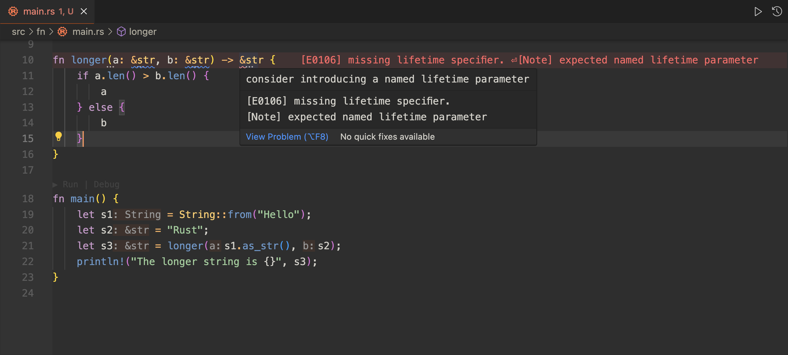
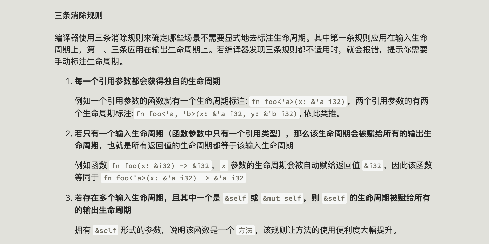
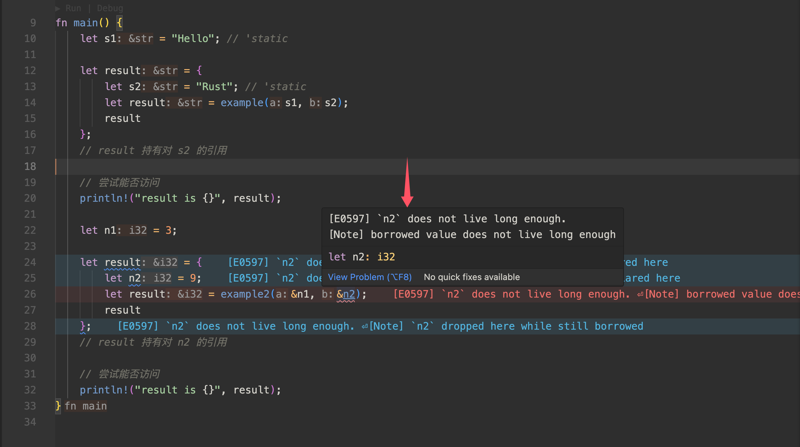

## 作用

生命周期即指一个变量的有效作用范围，它和 Scope 的概念听起来会有点类似。Scope（作用域）规定了变量能被访问的范围，超出了定义作用域的地方是不能访问作用域内定义的变量的。而 Lifetime（生命周期）是针对引用变量的，它表示一个引用变量可存活的范围，简单说也就是，如果我压根不存在引用的变量，那我遵循作用域的限制就够用了。但是一旦出现了引用和被引用的关系，单纯作用域的概念不够使用，可能会产生悬垂引用之类的问题，于是 Rust 为了确保所有操作都是内存安全的，制定了生命周期的一套概念。


## 悬垂指针 Dangling Pointer

悬垂指针指的是引用了内存已被释放的变量，如下：

```rust
fn main() {
    let r;
    {
        let x = 5;
        r = &x; 
      	// 🌟 drop(x) 这里在离开代码块前有一步隐藏的自动释放 x
    }

    // r 指向的引用 x 在离开代码块后就会被释放
    // 则以下代码访问 r 即产生了一个悬垂指针（dangling pointer）
    // —— 访问了已被释放内存的变量
    println!("This is a dangling pointer &r {}", &r);
}
```

悬垂引用的本质是变量的存活时间，也可以说是作用域链长度，通常来说，存活时间更长的变量去引用比它存活时间短的变量就会容易发生这类问题，Rust 编译期间就会检查出每个变量的有效作用范围，来避免这类异常。


## 函数中的生命周期

我们来实现一个函数 longer，接收两个字符串切片，然后返回长度更大的字符串切片：

```rust
fn longer(a: &str, b: &str) -> &str {
    if a.len() > b.len() {
        a
    } else {
        b
    }
}

fn main() {
    let s1 = String::from("Hello");
    let s2 = "Rust";
    let s3 = longer(s1.as_str(), s2);
    println!("The longer string is {}", s3);
}
```


我们得到如图的报错提示：



**Missing lifetime specifier** 缺少生命周期标注，这是为什么？我们上段有讲过，Rust 需要确保所有操作都是内存安全。而如何确保？就会需要足够的信息来分析生命周期，确保只会有短生命周期引用长生命周期的情况。所以，在 Rust 中每个变量都会有它自己的生命周期，代表它能存活多久。

那么讲回我们上面的 longer 函数，函数参数是两个变量 a 和 b，如果该函数没有返回值的情况下，那么这两个入参引用在函数执行完成后就无法被访问了，这是可以理解的。但我们现在给函数指定了返回一个字符串切片类型的变量，此时 Rust 编译器并不能分析出到底是返回入参 a 还是入参 b 还是别的什么情况，这些都是运行时才能确定的，这就导致了在静态编译期间 Rust 编译器判断不出返回值操作内存是否是安全的，这种状况对 Rust 来说是不允许的。

于是就需要开发者手动的**显式**标注生命周期，让编译器在编译时至少了解返回的变量对应的是哪个生命周期，以此来通过编译期间的安全检查。

📢 注意，生命周期标注并不会对**变量的实际生命周期**造成任何影响，仅是告知编译器及通过编译期间检查。


## 生命周期标注 Lifetime Specifier

写法：半个单引号 `'a`

```rust
&i32 // 一个引用
&'a i32 // 具有显式生命周期标注的引用
&'a mut i32 // 具有显式生命周期标注的可变引用
```


我们来修改下 longer 函数，对它加上显式的生命周期标注：

```rust
// 显式的告诉编译器，a,b,返回值 都属于同一个生命周期
// 因为返回值要么是 a 要么是 b
// 生命周期标注和泛型一样，也需要前置声明 <'a> 后才能使用
fn longer<'a>(a: &'a str, b: &'a str) -> &'a str {
    if a.len() > b.len() {
        a
    } else {
        b
    }
}

fn main() {
    let s1 = String::from("Hello");
    let s2 = "Rust";
    let s3 = longer(s1.as_str(), s2);
    println!("The longer string is {}", s3);
}
```


运行结果，如下：


那么可能会有疑惑，为什么我们之前的练习中，都没有需要显式生命周期标注的 case 呢？那是因为 Rust 编译器本身有自动推理生命周期的功能，并且如我们上面提到的“每个变量都有其对应的生命周期”，实际上我们定义的函数也会通过编译器被翻译，函数的每个入参都会被自动加上其对应的生命周期参数，而当我们并没有出现无法分析生命周期的情况时，在编译器自动推理能力范围内的 case 就不需要手动加上生命周期标注。

这是因为，如果函数压根没有返回值，自然就不需要生命周期标注的加持了。如果有返回值，假设函数的返回值是引用类型，那么它也只可能有两种来源：

- 函数某个入参的生命周期
- 函数内某个新建变量的生命周期

对于第一种情况，如果只有一个入参，那也就不需要生命周期标注。⚠️ **生命周期标注一定是出现在拥有多个生命周期的前提下的！** 而第二种情况，这是明显的悬垂指针，新建变量的生命周期仅在函数内部，函数外是无法对其进行引用的，直接会被编译器拒绝。

这种**无需手动**进行生命周期标注的能力被称为 “**生命周期消除（Lifetime Elision）**”，是编译器为了简化开发者的使用而自动运用的。具体的，会自动使用生命消除能力需要符合三条具体规则，可以参考一下截图要求：

（一般情况，只要编译器能通过编译，则证明无需手动进行生命周期标注）




## 对 生命周期标注 的总结

生命周期标注就是将函数的多个引用参数和返回值的作用域进行关联，一旦关联到一起后，Rust 便可以拥有充分的信息来分析和确保我们的操作是内存安全的。


## 结构体中的生命周期

当结构体中存在引用类型时，也会存在需要显式生命周期标注的 case：

```rust
// 结构体加上生命周期标注
struct Example<'a, 'b> {
  x: &'a str,
  y: &'b str,
}
```


## 方法中的生命周期

给 Example 结构体加上方法（methods）：

```rust
// 结构体加上生命周期标注
struct Example<'a, 'b> {
    x: &'a str,
    y: &'b str,
}

impl<'a, 'b> Example<'a, 'b> {
    // 这里我们并不需要标注因为我们的入参上含有 &self 或者 &mut self，
    // 其实就是符合了我们上面指出过的第一种 case，该方法有引用类型的返回值，
    // 无论是什么引用类型，只可能是来源于入参。
    // 此时如果仅一个入参，那么它的返回值生命周期一定是 self 的生命周期，
    // 且无论返回值有多少个，都一定只有一个生命周期。也就不需要手动添加生命周期标注了，
    // self 的生命周期 —— 即当前 Example 结构体实例会被直接赋予给这个方法的返回值。
    fn get_self(&self) -> &Example {
        self
    }
}
```


### 手动约束生命周期

另外还有一种手动约束多个生命周期的语法 —— `'a: 'b` 表示 `'a` 活的比 `'b` 时间长，用于当方法引用了多个生命周期的情况下，因为如果返回了一个较大的生命周期会产生悬垂引用，需要手动表明生命周期之间的关系：

```rust

// before
impl<'a> MyStruct<'a> {
  // 方法返回值为'b, 且该方法引用了'a, 那么只有 'b 存活时间一定比 'a 短才不会引起悬垂引用。
  // Rust 编译器并不能知道两者关系，需要手动加上生命周期约束。
  fn foo<'b>(&'a self, other: &'b str) -> &'b str {
  	self.name
	}
}

// after
impl<'a: 'b, 'a> MyStruct<'a> {
  fn foo<'b>(&'a self, other: &'b str) -> &'b str {
  	self.name
	}
}
```


## 特殊生命周期标注

### 静态生命周期

`'static` 标注是指这是一个静态生命周期，拥有静态生命周期的引用就表示可以和整个程序存活的一样久。

```rust
let s: &'static str = "我没啥优点，就是活得久，嘿嘿";
```

在 Rust 中，字符串字面量默认就是 静态生命周期，即不管字符串字面量定义在哪，它的生命周期默认都是整个程序存活期间。这里我们可以结合一个复杂点的例子来对比看下字符串字面量的生命周期和普通生命周期的差异。

有如下两个函数，分别都返回第二个入参，对应也都加上了生命周期标注：

```rust
fn example<'a>(a: &'a str, b: &'a str) -> &'a str {
    b
}

fn example2<'a>(a: &'a i32, b: &'a i32) -> &'a i32 {
    b
}
```


我们写两个一样的 case，一个用字符串字面量测试 对应 `example`，一个用 `i32` 类型测试 对应 `example2`：

```rust
let s1 = "Hello"; // 'static
let result = {
  let s2 = "Rust"; // 'static
  let result = example(s1, s2);
  result
};
// result 持有对 s2 的引用

// 尝试能否访问
println!("result is {}", result);

let n1 = 3;  // i32
let result = {
  let n2 = 9;  // i32
  let result = example2(&n1, &n2);
  result
};
// result 持有对 n2 的引用

// 尝试能否访问
println!("result is {}", result);
```


编辑器有如下报错：



**`n2` does not live long enough** 可以看到 case2 外面的 `result` 持有了对 `n2` 的引用，那么就意味着 `n2` 的生命周期应该长于外部的 `result`，但 `n2` 是代码块内部定义的变量，它的存活范围仅在代码块内部，则无法通过编译检查。

而同一个状况，因为 case1 中用到的是字符串字面量，字符串字面量本身的生命周期就是整个程序期间，这才通过了编译器的检查。


### 占位符默认匹配生命周期

当我们在实现方法时，如果并没有涉及多生命周期的情况，或者说都满足生命消除规则的条件下，其实就表示我们并不是很关心这个生命周期，这时候我们 `impl`  声明可以使用 `_` 占位符来表示默认匹配的那个生命周期，不需要给定一个具体的生命周期标注名了，因为在内层方法的实现上我们也不需要用到手动标注。

```rust
struct Counter<'a> {
    count: &'a mut i32,
}

// 占位符匹配默认的生命周期
// 该 Counter 结构体实例就一个生命周期
impl Counter<'_> {
    fn add(&mut self) {
        *self.count += 1;
    }
}
```


## 练习

巩固上面的理解，请修复下面的函数声明：


